1. Descripción del Proyecto

El presente proyecto consiste en el desarrollo de una aplicación web utilizando el framework Vue.js, cuyo objetivo es gestionar un catálogo de libros de manera interactiva.
La aplicación permite al usuario visualizar, agregar, editar, eliminar y consultar el detalle de libros, aplicando conceptos fundamentales del desarrollo frontend moderno, tales como componentes, comunicación entre ellos, enrutamiento y persistencia de datos.

2. Estructura del Proyecto
2.1. Componentes: LibroItem.vue
* Componente reutilizable que representa un libro individual.
* Recibe datos mediante props (titulo, autor, categoria).
* Emite eventos hacia el componente padre:
    * ver-detalle: para navegar al detalle del libro.
    * eliminar: para eliminar un libro.
    * editar: para editar un libro.
    * seleccionado: para incrementar el contador.

2.2. Vistas:
* InicioView.vue: Contiene la página principal con la bienvenida, además la navegación hacia el catálogo.
* ListaLibros.vue: Es la vista principal del sistema, la cual permite: visualizar libros, filtrar libros, agregar nuevos libros, editar y eliminar libros. Acá se utiliza un formulario dinámico para agregar y editar libros. Se implementa v-if y v-show para controlar la visualización y ae utiliza computed para el filtrado de los libros.
* DetalleLibro.vue: Muestra la información detallada de un libro seleccionado. Obtiene el id desde la URL mediante Vue Router. Una decisión importante fue que se implementa un sistema de carga de datos desde localStorage con un fallback a datos base en caso de que no existan datos guardados. 

2.3. App.vue
* Es el componente raiz, contiene la navegación principal, el <router-view> para renderizar vistas y contador de libros seleccionados de una manera simple, el cual se activa cuando se hace clic en un libro para revisar su detalle.

3. Comunicación entre componentes
Para que la comunicación entre componentes sea efectiva, se utilizaron dos mecanismos principales: los props que permiten pasar información desde el componente padre al hijo y los eventos que permiten enviar información desde el hijo al padre.
* LibroItem.vue emite eventos como ver-detalle y seleccionado.
* ListaLibros.vue captura estos eventos y los propaga a App.vue.

4. Funcionalidades
* Listado de libros
* Filtro por autor y categoría
* Agregar nuevos libros
* Editar libros existentes
* Eliminar libros
* Ver detalle de cada libro
* Contador de libros seleccionados (Es un historial de acciones, al momento de seleccionar un libro el contador aumenta)

5. Persistencia de datos: Se utiliza localStorage para guardar los libros ingresados por el usuario
* Al montar ListaLibros.vue, se cargan los libros desde localStorage si existen.
* Si no existen, se cargan libros base y se guardan en localStorage.
* Los libros agregados o editados se almacenan manualmente en el arreglo libros.

Este proyecto representó un desafío importante, ya que implicó integrar múltiples conceptos nuevos. A través de prueba y error, se logró comprender mejor el funcionamiento de Vue.js y la importancia de una buena estructura en aplicaciones web.

6. Capturas de pantalla de la app
* Inicio
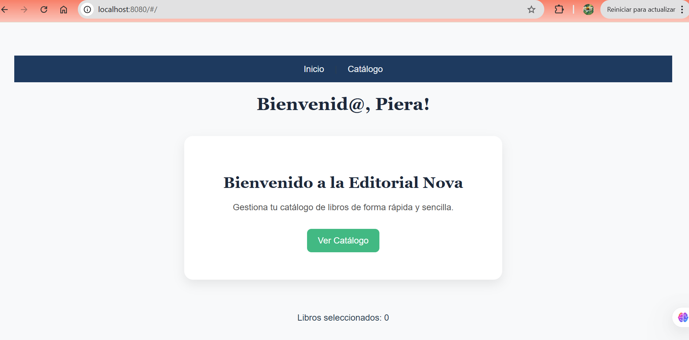
* Hacer clic en nav "Catálogo" o hacer clic en el botón "Ver Catálogo" 
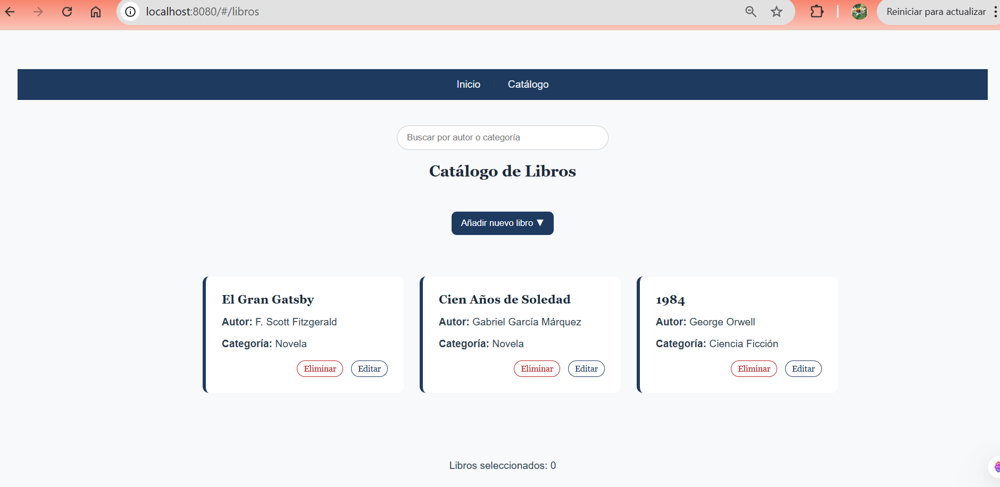
* Hacer clic a un libro, ingresamos al detalle y además aumenta el contador
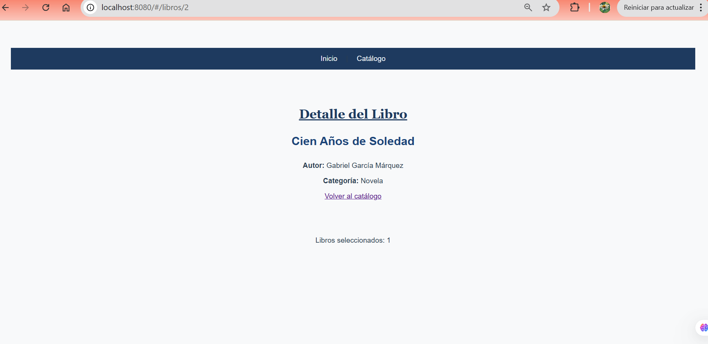
* Hacer clic a volver al catálogo
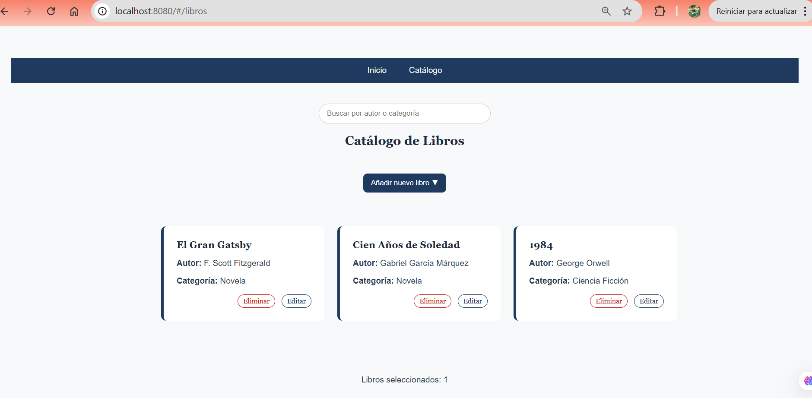
* Podemos buscar un libro por autor o categoría
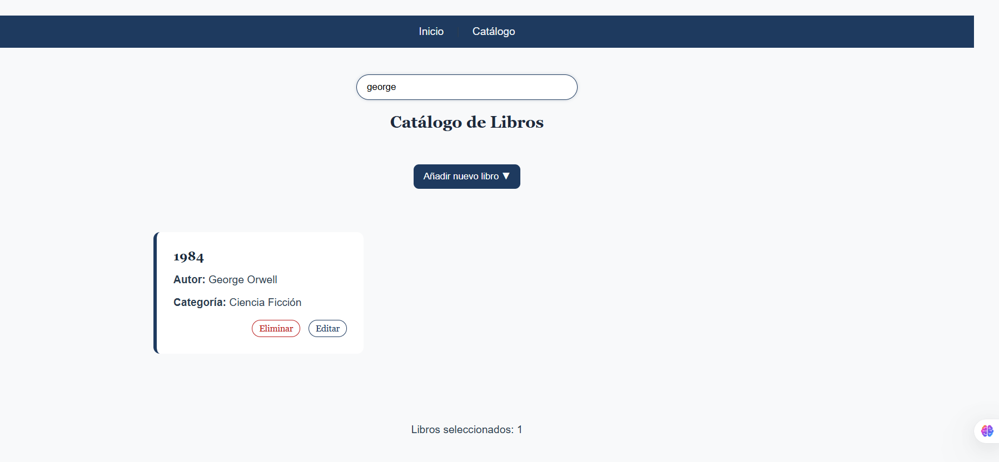
* Hacer clic en añadir nuevo libro
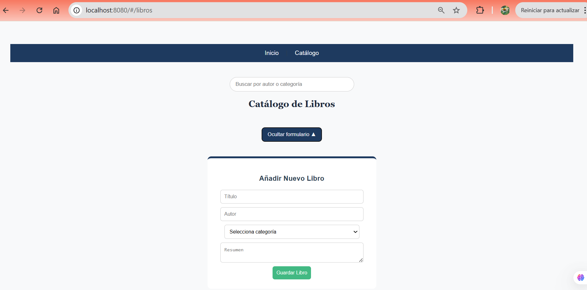
* Al querer agregar un libro nuevo, se debe rellenar si o si los campos de nombre título y autor
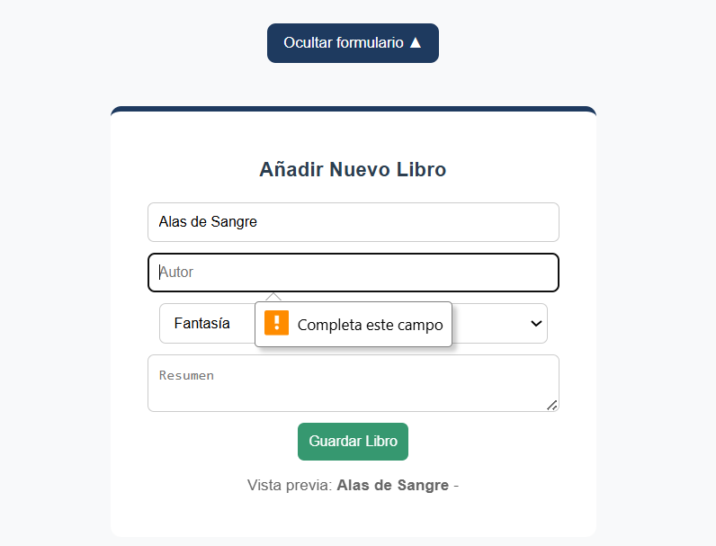
* Se agregar un libro nuevo
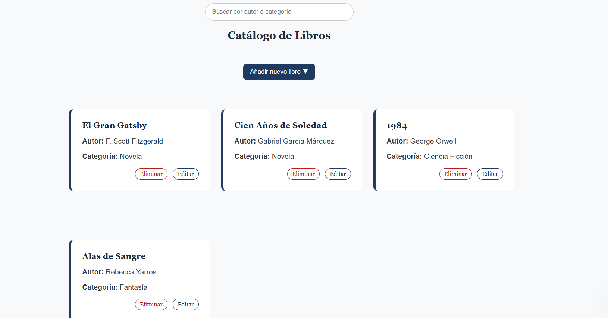
* Si hacemos clic en editar
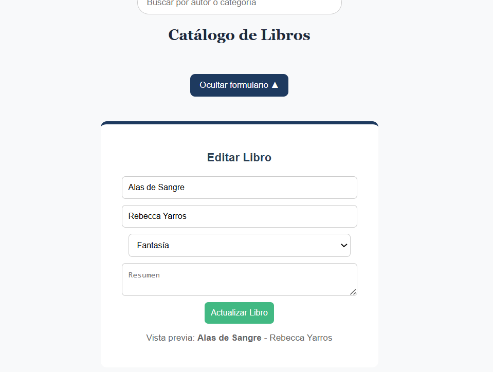
* Podemos eliminar los libros
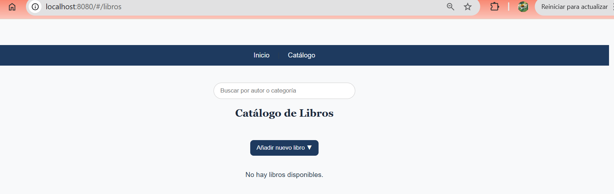
* Si recargamos la página estos libros no vuelven aparecer, solo los que estan de base al ir a inspeccionar, luego aplicación, borrar el array y recargar nuevamente apareceran de nuevo.. 
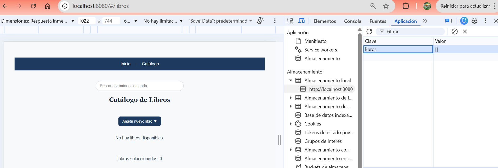
Luego se recarga la página y vuelven nuevamente los libros, creo que aqui se deberian hacer mejoras.
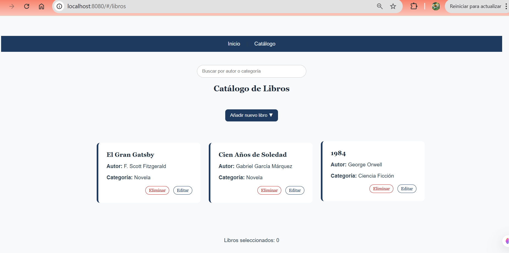
* Carpetas y archivos del proyecto
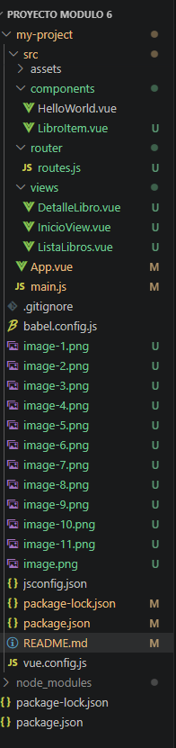
